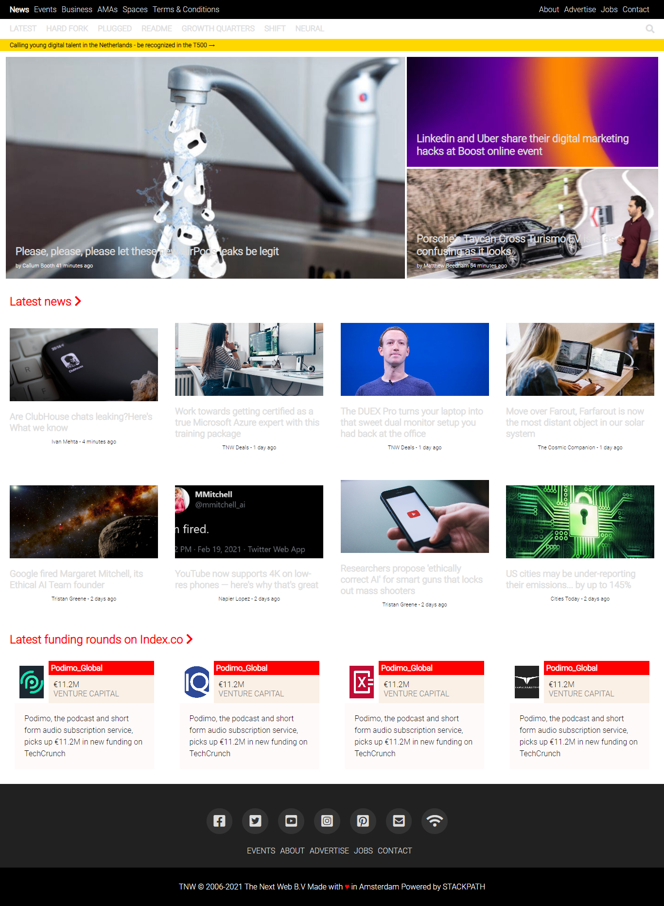

# Project Name

> The Next Web Clone.

Clone of thenextweb.com using flex and also making it responsive

## Built With

- HTML/CSS

## Live Demo

[Live Demo Link](https://agitated-tesla-1b2a75.netlify.app/)

## Getting Started

**This is an example of how you may give instructions on setting up your project locally.**
**Modify this file to match your project, remove sections that don't apply. For example: delete the testing section if the currect project doesn't require testing.**

To get a local copy up and running follow these simple example steps.

### Prerequisites

### Install

Just download the repo and run it locally.

## Authors

👤 **Author1**

- GitHub: [@githubhandle](https://github.com/MarkoNS1990)

## 🤝 Contributing

Contributions, issues, and feature requests are welcome!

Feel free to check the [issues page](issues/).

## Show your support

Give a ⭐️ if you like this project!

## Acknowledgments

- Hat tip to anyone whose code was used
- Inspiration
- etc

## 📝 License

This project is [MIT](lic.url) licensed.
